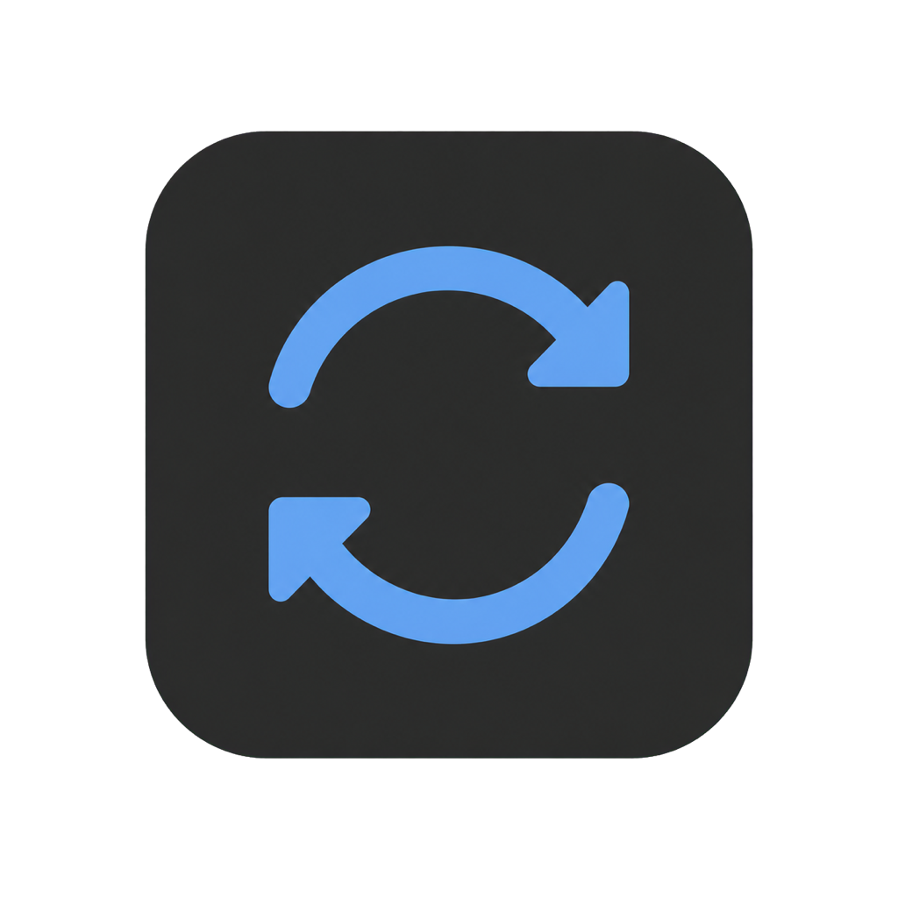
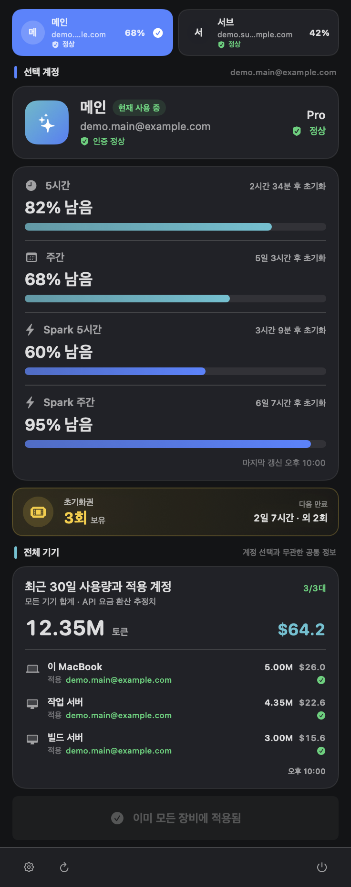
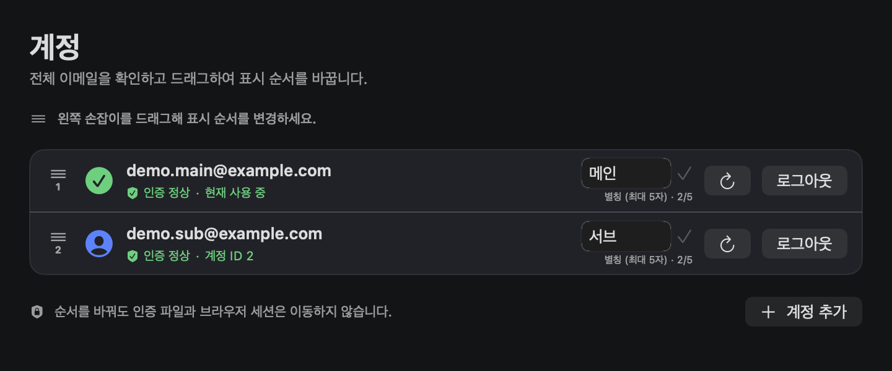

# Codex SyncBar

<p align="center">
  
</p>

여러 ChatGPT/Codex 계정을 이 Mac과 SSH 장치에서 한 번에 전환하는 macOS 메뉴 막대 앱입니다. 계정별 사용량과 인증 상태를 확인하고, 독립된 Chrome 로그인 세션을 이용해 필요한 계정만 안전하게 다시 로그인할 수 있습니다.

> 이 프로젝트는 개인용 유틸리티이며 OpenAI의 공식 제품이 아닙니다. ChatGPT 사용량 응답은 공개된 안정 API가 아니므로 OpenAI의 응답 형식이 바뀌면 일부 표시가 일시적으로 동작하지 않을 수 있습니다.

## 사용자 UI

아래 화면의 계정, 장치와 사용량은 README를 위해 만든 가상 예시이며 실제 사용자 정보가 아닙니다.

### 메뉴 막대 화면

계정을 선택하면 사용량, 초기화권과 모든 장치의 적용 상태를 한눈에 확인할 수 있습니다.

<p align="center">
  
</p>

### 설정 화면

계정의 별칭과 표시 순서를 관리하고, 필요한 계정만 다시 로그인하거나 로그아웃할 수 있습니다.

<p align="center">
  
</p>

## 주요 기능

- 계정을 두 개 이상 등록하고 별칭과 표시 순서를 관리합니다.
- 5시간, 주간, Spark 5시간, Spark 주간 한도를 막대 형태로 표시합니다.
- 메뉴 막대에는 원하는 사용량 항목을 0~2개까지 선택해 표시합니다.
- 초기화권 수량과 다음 만료 시각을 보기 쉽게 표시합니다.
- 선택한 계정을 이 Mac과 등록된 SSH 장치에 한 번에 적용합니다.
- 장치별 연결 상태, 적용 계정, 최근 30일 토큰 사용량과 API 가격 기준 추정 비용을 보여 줍니다.
- 계정마다 별도의 영구 Chrome 프로필을 사용해 Google 로그인과 패스키·Touch ID를 지원합니다.
- 로그인, 로그아웃, 인증 새로고침, 시작 프로그램 및 SSH 장치 관리는 설정 창에 모아 두었습니다.

## 설치 전 확인

- macOS 13 Ventura 이상
- `/Applications/Google Chrome.app`에 설치된 Google Chrome
- 공식 Codex CLI (`/opt/homebrew/bin/codex`, `/usr/local/bin/codex` 또는 `~/.local/bin/codex`)
- 로컬 및 SSH 장치의 `bash`, `jq`, `node`, `tar`
- SSH 장치를 사용할 경우, 해당 호스트의 키를 미리 `known_hosts`에 등록해야 합니다.

## 릴리즈로 설치하기

1. [Releases](https://github.com/IlIIlIIIlIII/CodexSyncBar/releases)에서 최신 `Codex-SyncBar-*-macOS-universal.zip`을 받습니다.
2. ZIP을 풀고 `Codex SyncBar.app`을 `/Applications`로 옮깁니다.
3. 처음 한 번은 Finder에서 앱을 Control-클릭한 뒤 **열기**를 선택합니다.
4. 메뉴 막대의 Codex SyncBar를 열고 **설정 → 계정 → 계정 추가**를 선택합니다.

공개 릴리즈는 Developer ID 공증이 아닌 ad-hoc 서명으로 만들어집니다. 따라서 macOS가 첫 실행을 확인할 수 있지만, 앱 번들의 서명 자체는 빌드 과정에서 검증됩니다.

원한다면 릴리즈에 함께 첨부된 `SHA256SUMS`로 다운로드 파일을 확인할 수 있습니다.

```bash
shasum -a 256 -c SHA256SUMS
```

## 처음 설정하기

### 1. 계정 추가

설정의 **계정** 페이지에서 계정을 추가하면 앱 전용 Chrome 창이 열립니다. 로그인 완료 전까지 기존 `auth.json`은 바뀌지 않습니다. 새 인증이 완전한 Codex 계정이고 다른 슬롯과 중복되지 않는지 확인한 뒤에만 계정 목록에 반영합니다.

각 계정은 고정된 양의 ID를 사용합니다.

- 인증 파일: `~/.local/share/gpt-switch/profiles/<계정 ID>.auth.json`
- Chrome 프로필: `~/Library/Application Support/Codex SyncBar/ChromeProfiles/profile-<계정 ID>`

별칭 변경이나 순서 이동은 표시만 바꾸며 인증 파일과 Chrome 세션의 위치는 바꾸지 않습니다.

### 2. SSH 장치 추가

설정의 **장치** 페이지에서 호스트, 포트, 사용자 이름과 인증 방법을 입력합니다. 새 장치는 비활성 상태로 저장되며 **설치 및 활성화**가 성공해야 전체 전환 대상에 포함됩니다.

지원하는 인증 방법은 다음과 같습니다.

- 기존 OpenSSH 설정
- 개인 키와 선택적 OpenSSH 인증서·키 암호
- SSH 비밀번호

활성화할 때 앱은 원격 helper를 설치하고, 등록된 계정을 전송하고, 현재 계정이 실제로 적용됐는지 검증합니다. 중간 단계가 실패하면 새 장치를 활성화하지 않고 가능한 범위에서 이전 상태로 복구합니다. 새로 설치한 앱에는 SSH 장치가 미리 등록되어 있지 않습니다.

### 3. 계정 전환

메뉴의 계정 버튼을 누르고 **모든 장치에 전환**을 선택하면 추가 확인 창 없이 전환을 시작합니다. 모든 장치를 먼저 점검한 뒤 변경하며, 실패하면 이미 변경된 장치를 이전 계정으로 되돌립니다.

전환 후에는 이전 인증을 캐시할 수 있는 Codex `app-server`만 선별해 다시 시작합니다. 실행 중인 일반 Codex CLI 작업과 TCP 기반의 별도 서버는 종료하지 않습니다.

## 인증과 보안

- 전체 refresh token은 이 Mac의 권한 `0600` 인증 파일에만 보관합니다.
- SSH 장치에는 `refresh_token`을 비운 access-only 인증만 전달합니다.
- SSH 비밀번호와 개인 키 암호는 macOS Keychain의 기기 전용 항목에만 저장합니다.
- 비밀값은 설정 JSON, 프로세스 인자, 환경 변수 또는 로그에 기록하지 않습니다.
- 개인 키와 인증서는 절대 경로의 일반 파일이어야 하며 심볼릭 링크를 허용하지 않습니다.
- 개인 키 소유자는 현재 사용자여야 하고 권한은 `0400` 또는 `0600`이어야 합니다.
- SSH는 strict host-key checking을 사용하고 agent, X11, 포트 포워딩과 TTY 할당을 차단합니다.
- 인증 파일 변경은 임시 파일 작성, 권한 검증, 원자적 교체 순서로 진행합니다.
- 계정 전환은 모든 장치의 사전 점검과 사후 검증을 통과해야 완료됩니다.

Chrome 쿠키와 Codex 토큰은 서로 다른 세션입니다. 앱 업데이트나 일시적인 네트워크 오류만으로 삭제되지는 않지만, OpenAI/Google에서 로그아웃했거나 보안 설정 변경·관리자 회수·refresh token 폐기가 발생하면 재로그인이 필요할 수 있습니다.

## 사용량과 비용 표시

- 계정 한도는 현재 선택한 계정의 Codex 호환 사용량 응답을 이용합니다.
- 장치 누적 사용량은 각 장치에 보존된 Codex 세션을 최근 30일 기준으로 집계합니다.
- 비용은 모델별 공개 API 가격과 캐시 입력 가격을 기준으로 계산한 **추정치**입니다.
- Fast/Priority 배율을 반영하지만, 공개 가격이 없는 모델은 임의의 가격을 만들지 않습니다.
- 이 값은 ChatGPT 구독 청구액이 아니며 OpenAI 사용량 대시보드와 완전히 같지 않을 수 있습니다.

## 문제가 생겼을 때

### 재로그인 안내가 반복되는 경우

설정의 계정 상태에서 **재로그인**을 선택하세요. 인증 파일이 존재하는 것만으로 refresh token의 유효성을 보장할 수 없으므로 앱은 실제 갱신 경로를 확인합니다.

### SSH 장치에 이전 계정이 남는 경우

1. 장치 상태를 새로고침합니다.
2. 설정의 장치 페이지에서 해당 장치를 다시 **설치 및 활성화**합니다.
3. helper 버전과 현재 계정 검증이 완료된 뒤 다시 전환합니다.

### `another controller operation is already running`이 표시되는 경우

다른 전환·갱신 작업이 끝날 때까지 잠시 기다린 뒤 새로고침하세요. 앱과 shell helper가 같은 잠금을 사용하므로 동시에 인증 파일을 변경하지 않습니다. 비정상 종료된 작업의 잠금은 소유 프로세스와 파일 권한을 확인한 뒤에만 자동 복구합니다.

### Chrome 로그인이 원하는 계정으로 열리지 않는 경우

설정의 해당 계정에서 Chrome 세션을 로그아웃한 뒤 재로그인하세요. 계정별 Chrome 프로필은 분리되어 있으며 다른 계정의 쿠키를 삭제하지 않습니다.

## 소스에서 빌드하기

```bash
bash Tests/helper-contract-tests.sh
swift test
./build-app.sh
```

유니버설 바이너리로 패키징하려면 다음과 같이 실행합니다.

```bash
CODEX_SYNCBAR_UNIVERSAL=1 ./build-app.sh
```

기본 출력 위치는 이 저장소 기준 `../../outputs`입니다. 다른 위치를 사용하려면 첫 번째 인자로 경로를 전달하세요.

```bash
./build-app.sh "$PWD/release-assets"
```

빌드에는 앱과 동일한 `gpt-switch`, Keychain askpass bridge, 사용량 집계 helper가 포함됩니다. 앱 실행 시 다음 위치에 원자적으로 설치합니다.

- `~/.local/bin/gpt-switch`
- `~/.local/lib/gpt-switch/codex-syncbar-askpass`
- `~/.local/lib/gpt-switch/usage-summary.mjs`

## 데이터 위치와 삭제

주요 데이터는 다음 위치에 있습니다.

- 설정과 계정 인증: `~/.local/share/gpt-switch`
- 앱 전용 Chrome 세션: `~/Library/Application Support/Codex SyncBar`
- SSH 비밀번호·키 암호: macOS Keychain 서비스 `com.sunggu.codexsyncbar.ssh`

앱만 제거하려면 `/Applications/Codex SyncBar.app`을 휴지통으로 옮기면 됩니다. 계정·Chrome 세션·Keychain 항목까지 지우려면 먼저 설정에서 장치와 계정을 정리한 뒤 위 데이터 디렉터리를 삭제하세요. 원격 장치의 파일은 Mac 앱을 삭제하는 것만으로 자동 삭제되지 않습니다.

## 개발 메모

사용량 응답 처리는 `UsageService.swift`, 장치별 최근 30일 집계는 `TokenUsageService.swift`에 분리되어 있습니다. 로그인은 설치된 공식 Codex CLI의 app-server를 사용하며, 브라우저에는 `auth.openai.com`의 HTTPS 인증 URL만 전달합니다.
