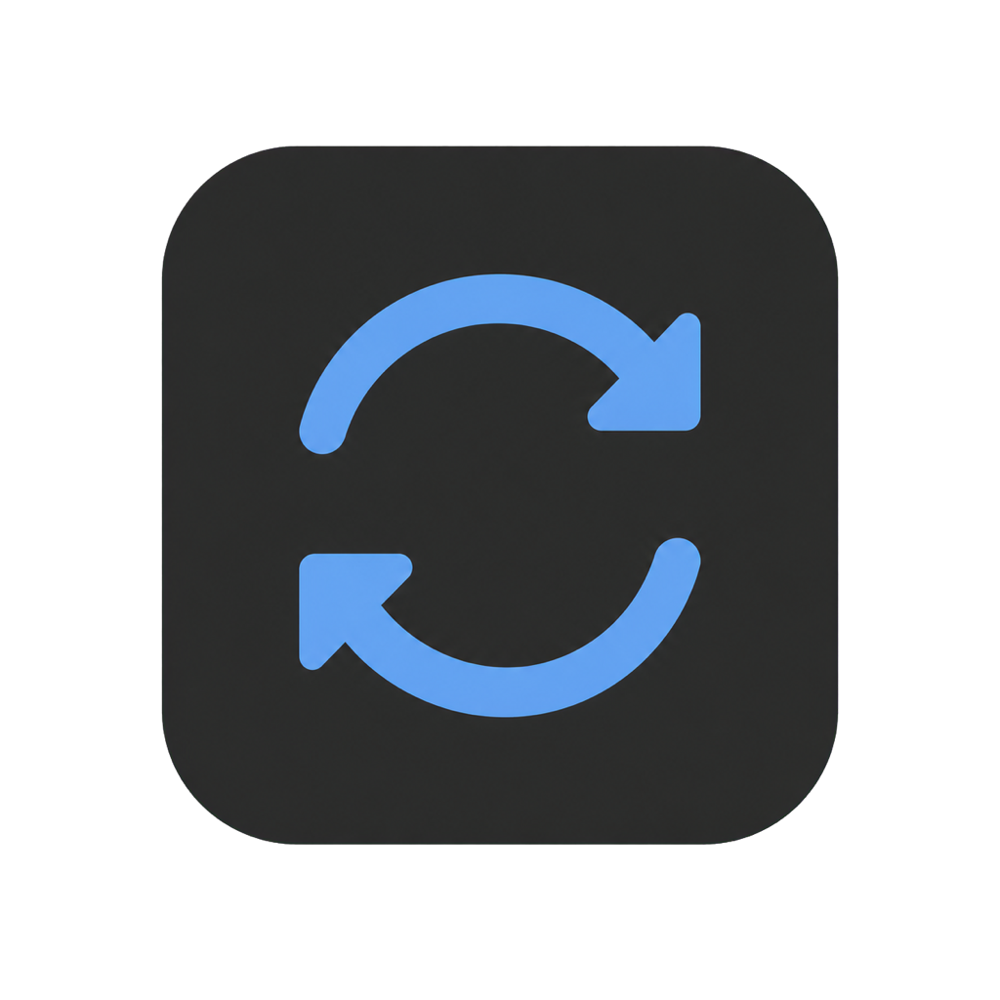
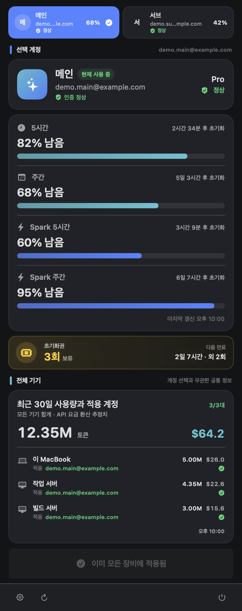
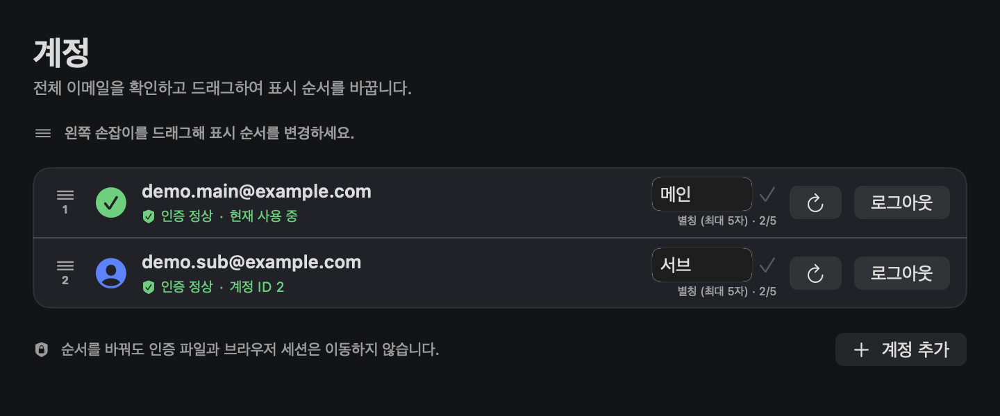

# Codex SyncBar

<p align="center">
  
</p>

여러 ChatGPT/Codex 계정을 이 Mac과 SSH 장치에서 한 번에 전환하는 macOS 메뉴 막대 앱입니다. 계정별 사용량과 인증 상태를 확인하고, 독립된 Chrome 로그인 세션을 이용해 필요한 계정만 안전하게 다시 로그인할 수 있습니다.

> 이 프로젝트는 개인용 유틸리티이며 OpenAI의 공식 제품이 아닙니다. ChatGPT 사용량 응답은 공개된 안정 API가 아니므로 OpenAI의 응답 형식이 바뀌면 일부 표시가 일시적으로 동작하지 않을 수 있습니다.

## 사용자 UI

아래 화면의 계정, 장치와 사용량은 README를 위해 만든 가상 예시이며 실제 사용자 정보가 아닙니다.

### 메뉴 막대 화면

계정을 선택하면 사용량, 초기화권과 모든 장치의 적용 상태를 한눈에 확인할 수 있습니다.

<p align="center">
  
</p>

### 설정 화면

계정의 별칭과 표시 순서를 관리하고, 필요한 계정만 다시 로그인하거나 로그아웃할 수 있습니다.

<p align="center">
  
</p>

## 주요 기능

- 계정을 두 개 이상 등록하고 별칭과 표시 순서를 관리합니다.
- 5시간, 주간, Spark 5시간, Spark 주간 한도를 막대 형태로 표시합니다.
- 메뉴 막대에는 원하는 사용량 항목을 0~2개까지 선택해 표시합니다.
- 초기화권 수량과 다음 만료 시각을 보기 쉽게 표시합니다.
- 선택한 계정을 이 Mac과 등록된 SSH 장치에 한 번에 적용합니다.
- 장치별 연결 상태, 적용 계정, 최근 30일 토큰 사용량과 API 가격 기준 추정 비용을 보여 줍니다.
- 계정마다 별도의 영구 Chrome 프로필을 사용해 Google 로그인과 패스키·Touch ID를 지원합니다.
- 로그인, 로그아웃, 인증 새로고침, 시작 프로그램 및 SSH 장치 관리는 설정 창에 모아 두었습니다.
- 실험 기능으로 Cursor CLI 구독 모델을 로컬 Responses 브리지로 Codex의 기존 모델 선택기에 추가합니다. SyncBar 설정에서 Codex에 표시할 Cursor 모델을 고를 수 있고, 각 모델은 기본 모델 단위로 표시됩니다. Codex 앱의 추론 강도·Fast 선택은 실제 Cursor variant로 변환되며 원래 설정으로 복구할 수 있습니다.

## 설치 전 확인

- macOS 13 Ventura 이상
- `/Applications/Google Chrome.app`에 설치된 Google Chrome
- 공식 Codex CLI (`/opt/homebrew/bin/codex`, `/usr/local/bin/codex` 또는 `~/.local/bin/codex`)
- 로컬 및 SSH 장치의 `bash`, `jq`, `node`, `tar`
- Cursor 구독 모델 브리지를 이 Mac에서 사용할 경우 공식 Cursor CLI의 `cursor-agent`와 완료된 `cursor-agent login`
- SSH 장치를 사용할 경우, 해당 호스트의 키를 미리 `known_hosts`에 등록해야 합니다.

## 릴리즈로 설치하기

1. [Releases](https://github.com/IlIIlIIIlIII/CodexSyncBar/releases)에서 최신 `Codex-SyncBar-*-macOS-universal.zip`을 받습니다.
2. ZIP을 풀고 `Codex SyncBar.app`을 `/Applications`로 옮깁니다.
3. Finder에서 앱을 엽니다. 1.0.4 이후 공개 릴리즈는 Apple 공증을 거치므로 별도의 Gatekeeper 우회가 필요하지 않습니다.
4. 메뉴 막대의 Codex SyncBar를 열고 **설정 → 계정 → 계정 추가**를 선택합니다.

1.0.4 이후 공개 릴리즈는 Developer ID로 서명하고 Apple 공증을 통과한 뒤 공증 티켓을 앱에 첨부합니다. 다운로드한 ZIP을 풀어 `/Applications`로 옮기면 Gatekeeper가 개발자 신원과 공증 상태를 확인할 수 있습니다. 로컬 `./build-app.sh` 실행은 Developer ID가 없으면 기존처럼 ad-hoc 서명을 사용합니다.

원한다면 릴리즈에 함께 첨부된 `SHA256SUMS`로 다운로드 파일을 확인할 수 있습니다.

```bash
shasum -a 256 -c SHA256SUMS
```

## 처음 설정하기

### 1. 계정 추가

설정의 **계정** 페이지에서 계정을 추가하면 앱 전용 Chrome 창이 열립니다. 로그인 완료 전까지 기존 `auth.json`은 바뀌지 않습니다. 새 인증이 완전한 Codex 계정이고 다른 슬롯과 중복되지 않는지 확인한 뒤에만 계정 목록에 반영합니다.

각 계정은 고정된 양의 ID를 사용합니다.

- 인증 파일: `~/.local/share/gpt-switch/profiles/<계정 ID>.auth.json`
- Chrome 프로필: `~/Library/Application Support/Codex SyncBar/ChromeProfiles/profile-<계정 ID>`

별칭 변경이나 순서 이동은 표시만 바꾸며 인증 파일과 Chrome 세션의 위치는 바꾸지 않습니다.

### 2. SSH 장치 추가

설정의 **장치** 페이지에서 호스트, 포트, 사용자 이름과 인증 방법을 입력합니다. 새 장치는 비활성 상태로 저장되며 **설치 및 활성화**가 성공해야 전체 전환 대상에 포함됩니다.

지원하는 인증 방법은 다음과 같습니다.

- 기존 OpenSSH 설정
- 개인 키와 선택적 OpenSSH 인증서·키 암호
- SSH 비밀번호

활성화할 때 앱은 원격 helper를 설치하고, 등록된 계정을 전송하고, 현재 계정이 실제로 적용됐는지 검증합니다. 중간 단계가 실패하면 새 장치를 활성화하지 않고 가능한 범위에서 이전 상태로 복구합니다. 새로 설치한 앱에는 SSH 장치가 미리 등록되어 있지 않습니다.

### 3. 계정 전환

메뉴의 계정 버튼을 누르고 **모든 장치에 전환**을 선택하면 추가 확인 창 없이 전환을 시작합니다. 모든 장치를 먼저 점검한 뒤 변경하며, 실패하면 이미 변경된 장치를 이전 계정으로 되돌립니다.

전환 후에는 이전 인증을 캐시할 수 있는 Codex `app-server`만 선별해 다시 시작합니다. 실행 중인 일반 Codex CLI 작업과 TCP 기반의 별도 서버는 종료하지 않습니다.

### 4. Cursor 구독 모델 연결 (실험)

1. [공식 Cursor CLI](https://cursor.com/docs/cli/installation)를 설치하고 터미널에서 `cursor-agent login`을 완료합니다.
2. 사용 가능한 exact slug는 `cursor-agent --list-models`로 확인할 수 있습니다. SyncBar도 같은 목록을 자동으로 불러옵니다.
3. SyncBar의 **설정 → 모델**에서 base 모델과 필요한 경우 Thinking, localhost 포트를 선택한 뒤 **Codex 기본 모델로 사용**을 누릅니다.
4. SyncBar가 기존 Codex 모델을 보존한 병합 카탈로그를 만들고 최상위 `model_catalog_json`에 연결합니다. Cursor의 exact variant는 기본 모델과 Thinking 여부로 묶어 `Cursor · GPT · …`, `Cursor · Codex · …`처럼 표시합니다. Reasoning과 Fast는 Codex 앱의 기존 선택창에서 고르며, 목록에 실제로 존재하는 조합만 광고하고 exact Cursor slug로 변환합니다.
5. SyncBar가 캐시된 로컬 Codex `app-server`만 종료해 시작 시 카탈로그와 설정을 다시 읽게 합니다. 새 Codex 작업은 `syncbar_cursor_bridge` provider를 사용하고, 실행 중인 일반 Codex CLI는 종료하지 않습니다.
6. SSH에서도 사용할 때는 Cursor Dashboard에서 만든 User API Key를 **설정 → 모델 → SSH 원격 Cursor**에 저장합니다. 키는 이 Mac의 기기 전용 Keychain에 보관되며, 활성 SSH 장치로 동기화할 때 stdin으로만 전달됩니다.
7. 원격 호스트에는 공식 Cursor 설치 스크립트로 `agent`를 자동 설치하고 SyncBar 전용 bridge·manager와 격리된 Cursor 인증 저장소를 구성합니다. macOS Cursor 로그인/Keychain 파일을 Linux에 복사하거나 변환하지 않습니다.
8. **이전 Codex 모델로 복구**를 누르면 SyncBar가 바꾼 로컬 및 연결 가능한 SSH 장치의 최상위 `model`·`model_provider`·`model_catalog_json`과 관리 provider 블록을 원래 값으로 되돌리고, 원격 전용 runtime·Cursor 인증 저장소도 제거합니다. 설정이 외부에서 바뀌었다면 덮어쓰지 않고 해당 장치를 정리 실패로 표시합니다.
9. 설정의 **Cursor 계정**에서 현재 CLI 로그인 이메일을 확인하고 공식 사용량 대시보드를 열 수 있습니다. **계정 연결 삭제**는 provider 복구, 브리지 중지, `cursor-agent logout`, Keychain API key 및 원격 자격증명 정리를 수행하지만 Cursor.com 웹 계정과 구독 자체는 삭제하지 않습니다.

SyncBar 실행 환경에 절대 경로 `CODEX_HOME`이 있으면 해당 `config.toml`을 사용하고, 그렇지 않으면 `~/.codex/config.toml`을 사용합니다. 실제 대상 경로는 설정 화면에 표시합니다.

브리지는 로컬과 원격 모두 `127.0.0.1`에만 바인딩하며 요청마다 비공개 고엔트로피 bearer/header를 검증합니다. 텍스트 요청은 Cursor CLI headless agent로, 이미지나 Computer Use 스크린샷이 포함된 요청은 공식 ACP 이미지 블록으로 전달합니다. Cursor에는 실제 프로젝트 대신 전용 빈 작업공간, ask mode, sandbox와 deny 정책을 전달하고 `--force`/`--yolo`는 사용하지 않습니다. ACP 세션에서도 모델·context·Reasoning/Effort·Thinking·Fast를 선택한 exact variant와 대조하며, native tool이나 권한 요청이 시작되면 응답을 중단합니다. 그래도 Cursor의 사용자 전역 rules·hooks·MCP 설정과 현행 권한 표면을 완전히 격리한다고 보장할 수 없으므로 이 기능은 실험 기능입니다.

Cursor CLI는 raw inference API가 아니라 agent workflow입니다. Cursor 항목의 요청 횟수와 비용은 로그인된 Cursor 계정의 구독 pool을 따르며, SyncBar의 OpenAI 계정 사용량 화면에는 합산되지 않습니다. 병합 선택기의 기존 Codex 항목은 로컬 브리지가 고정된 공식 OpenAI/ChatGPT endpoint로만 전달하며, Cursor 항목은 Cursor CLI로 보냅니다. 브리지는 Responses의 `function`·`custom`·`namespace` 도구 루프와 Codex가 만든 inline 이미지 입력을 지원합니다. `input_file.file_data`는 엄격한 Base64 검증 뒤 텍스트·코드·Markdown·HTML·CSV·JSON·XML, DOCX·PPTX·XLSX·ODT, 이미지, PDF를 처리합니다. Office 문서는 제한된 별도 프로세스에서 텍스트만 추출하고, PDF는 이 Mac에 번들된 PDFKit helper로 텍스트와 최대 16장의 페이지 이미지를 함께 전달합니다. 원본 Base64와 임시 경로는 Cursor 프롬프트에 남기지 않습니다. 브리지 제한은 파일 8개, 파일당 12 MiB, 합계 24 MiB, 추출 텍스트 파일당 2 MiB·합계 4 MiB이며 PDF 페이지 이미지는 일반 이미지와 동일한 16장·24 MiB 한도를 공유합니다. 원격 Linux에는 PDFKit helper가 없으므로 PDF는 명시적으로 거절하지만 텍스트와 Office 문서는 처리할 수 있습니다.

Cursor 개인 플랜은 월간 사용량·남은 구독 pool을 반환하는 공개 API나 CLI 명령을 제공하지 않습니다. SyncBar는 비공개 dashboard endpoint를 역공학하거나 로컬 요청량을 구독 잔여량으로 가장하지 않고, 공식 `cursor.com/dashboard/usage` 화면을 엽니다. Team/Enterprise의 Admin API는 별도 조직 관리자 키가 필요한 다른 인증 경계이므로 저장된 개인 User API Key로 호출하지 않습니다.

현재 Codex Desktop의 일반 파일 선택기는 파일 바이트를 Responses `input_file`로 보내지 않고 `## 이름: 절대경로` 텍스트와 UI용 attachment metadata를 전송합니다. 이 경우 Cursor가 파일을 직접 읽는 대신 제공된 Codex outer `exec`/파일 도구를 요청하고, 실제 읽기는 원래 프로젝트의 Codex sandbox·승인 경계 안에서 수행됩니다. 따라서 Cursor CLI 자체에는 프로젝트 workspace 읽기 권한을 열지 않습니다. 위 `file_data` 지원은 해당 wire를 보내는 Responses 클라이언트와 materialized attachment에 직접 적용됩니다. 보안 경계를 우회하는 `file://`·임의 로컬 경로 읽기, OpenAI Files 자격 증명이 필요한 `file_id`, 원격 `file_url`은 명시적으로 거절합니다.

HTML 그래프는 Codex의 outer tool이 visualization 파일을 만든 뒤 반환하는 inline directive를 byte-for-byte 보존합니다. Computer Use·브라우저·이미지 생성은 Codex의 outer custom/plugin tool이 실행하고, 그 결과 이미지나 스크린샷을 다음 Cursor turn에 전달하는 방식으로 동작합니다. Cursor ACP가 제공하지 않는 direct `computer_call`·provider-side `image_generation_call`과 오디오 입력은 지원하지 않으며 조용히 버리지 않고 오류로 종료합니다. `web_search`·`image_generation`·`tool_search`는 요청 전체를 실패시키지 않되 Cursor backend에는 사용할 수 없는 도구로 표시합니다. 변환된 프롬프트는 프로세스 인자가 아닌 stdin으로 전달합니다. `max`는 Codex의 모델 기능 설정에 따라 별도 활성화가 필요할 수 있습니다.

## 인증과 보안

- 전체 refresh token은 이 Mac의 권한 `0600` 인증 파일에만 보관합니다.
- SSH 장치에는 `refresh_token`을 비운 access-only 인증만 전달합니다.
- SSH 비밀번호와 개인 키 암호는 macOS Keychain의 기기 전용 항목에만 저장합니다.
- Cursor User API Key는 이 Mac의 기기 전용 Keychain에 저장합니다. SSH 동기화 후에는 원격 `~/.local/share/gpt-switch/cursor-remote-runtime.json`과 전용 Cursor XDG 저장소에도 소유자 전용 `0600` 파일로 보관되며, 원격 저장본은 macOS Keychain처럼 암호화된 파일이 아닙니다.
- 원격 Cursor Agent는 SyncBar 전용 `HOME`·`XDG_CONFIG_HOME`과 현행 CLI의 비공개 file credential-store 선택자를 사용합니다. 이 선택자는 Cursor의 문서화된 호환 계약이 아니므로 CLI 업데이트 뒤 status·model·bridge health 검증이 실패하면 SyncBar도 안전하게 중단합니다.
- Cursor API key와 bridge token은 SSH 명령, 프로세스 인자, Codex 설정, 정상 stdout/stderr에 넣지 않습니다. 원격 manager는 저장된 API key를 Cursor 자식 프로세스의 `CURSOR_API_KEY` 환경으로만 주입합니다.
- 이 Mac의 Keychain 키만 삭제해도 이미 동기화된 원격 키는 남습니다. **이전 Codex 모델로 복구**로 원격을 함께 정리하거나, 실패한 장치가 다시 연결된 뒤 복구를 재시도해야 합니다.
- 개인 키와 인증서는 절대 경로의 일반 파일이어야 하며 심볼릭 링크를 허용하지 않습니다.
- 개인 키 소유자는 현재 사용자여야 하고 권한은 `0400` 또는 `0600`이어야 합니다.
- SSH는 strict host-key checking을 사용하고 agent, X11, 포트 포워딩과 TTY 할당을 차단합니다.
- 인증 파일 변경은 임시 파일 작성, 권한 검증, 원자적 교체 순서로 진행합니다.
- 계정 전환은 모든 장치의 사전 점검과 사후 검증을 통과해야 완료됩니다.

Chrome 쿠키와 Codex 토큰은 서로 다른 세션입니다. 앱 업데이트나 일시적인 네트워크 오류만으로 삭제되지는 않지만, OpenAI/Google에서 로그아웃했거나 보안 설정 변경·관리자 회수·refresh token 폐기가 발생하면 재로그인이 필요할 수 있습니다.

## 사용량과 비용 표시

- 계정 한도는 현재 선택한 계정의 Codex 호환 사용량 응답을 이용합니다.
- 장치 누적 사용량은 각 장치에 보존된 Codex 세션을 최근 30일 기준으로 집계합니다.
- 비용은 모델별 공개 API 가격과 캐시 입력 가격을 기준으로 계산한 **추정치**입니다.
- Fast/Priority 배율을 반영하지만, 공개 가격이 없는 모델은 임의의 가격을 만들지 않습니다.
- 이 값은 ChatGPT 구독 청구액이 아니며 OpenAI 사용량 대시보드와 완전히 같지 않을 수 있습니다.

## 문제가 생겼을 때

### 재로그인 안내가 반복되는 경우

설정의 계정 상태에서 **재로그인**을 선택하세요. 인증 파일이 존재하는 것만으로 refresh token의 유효성을 보장할 수 없으므로 앱은 실제 갱신 경로를 확인합니다.

### SSH 장치에 이전 계정이 남는 경우

1. 장치 상태를 새로고침합니다.
2. 설정의 장치 페이지에서 해당 장치를 다시 **설치 및 활성화**합니다.
3. helper 버전과 현재 계정 검증이 완료된 뒤 다시 전환합니다.

### `another controller operation is already running`이 표시되는 경우

다른 전환·갱신 작업이 끝날 때까지 잠시 기다린 뒤 새로고침하세요. 앱과 shell helper가 같은 잠금을 사용하므로 동시에 인증 파일을 변경하지 않습니다. 비정상 종료된 작업의 잠금은 소유 프로세스와 파일 권한을 확인한 뒤에만 자동 복구합니다.

### Chrome 로그인이 원하는 계정으로 열리지 않는 경우

설정의 해당 계정에서 Chrome 세션을 로그아웃한 뒤 재로그인하세요. 계정별 Chrome 프로필은 분리되어 있으며 다른 계정의 쿠키를 삭제하지 않습니다.

## 소스에서 빌드하기

```bash
bash Tests/helper-contract-tests.sh
swift test
./build-app.sh
```

유니버설 바이너리로 패키징하려면 다음과 같이 실행합니다.

```bash
CODEX_SYNCBAR_UNIVERSAL=1 ./build-app.sh
```

기본 출력 위치는 이 저장소 기준 `../../outputs`입니다. 다른 위치를 사용하려면 첫 번째 인자로 경로를 전달하세요.

```bash
./build-app.sh "$PWD/release-assets"
```

빌드에는 앱과 동일한 `gpt-switch`, Keychain askpass bridge, 사용량 집계 helper가 포함됩니다. 앱 실행 시 다음 위치에 원자적으로 설치합니다.

- `~/.local/bin/gpt-switch`
- `~/.local/lib/gpt-switch/codex-syncbar-askpass`
- `~/.local/lib/gpt-switch/usage-summary.mjs`
- `~/.local/lib/gpt-switch/cursor-codex-bridge.mjs`
- `~/.local/lib/gpt-switch/cursor-file-extractor`
- `~/.local/lib/gpt-switch/cursor-remote-manager.mjs`

`v*` 태그 릴리즈는 다음 GitHub Actions secret이 모두 있어야 실행됩니다. P12와 App Store Connect API 개인 키는 각각 base64로 저장합니다.

- `APPLE_DEVELOPER_ID_P12_BASE64`
- `APPLE_DEVELOPER_ID_P12_PASSWORD`
- `APPLE_NOTARY_KEY_BASE64`
- `APPLE_NOTARY_KEY_ID`
- `APPLE_NOTARY_ISSUER_ID`

## 데이터 위치와 삭제

주요 데이터는 다음 위치에 있습니다.

- 설정과 계정 인증: `~/.local/share/gpt-switch`
- 앱 전용 Chrome 세션: `~/Library/Application Support/Codex SyncBar`
- SSH 비밀번호·키 암호: macOS Keychain 서비스 `com.sunggu.codexsyncbar.ssh`
- Cursor User API Key: macOS Keychain 서비스 `com.sunggu.codexsyncbar.cursor`
- SSH 원격 Cursor runtime·인증: 원격 `~/.local/share/gpt-switch/cursor-remote-runtime.json` 및 `cursor-remote-xdg/`

앱만 제거하려면 `/Applications/Codex SyncBar.app`을 휴지통으로 옮기면 됩니다. 계정·Chrome 세션·Keychain 항목까지 지우려면 먼저 설정에서 장치와 계정을 정리한 뒤 위 데이터 디렉터리를 삭제하세요. 원격 장치의 파일은 Mac 앱을 삭제하는 것만으로 자동 삭제되지 않습니다.

## 개발 메모

사용량 응답 처리는 `UsageService.swift`, 장치별 최근 30일 집계는 `TokenUsageService.swift`에 분리되어 있습니다. 로그인은 설치된 공식 Codex CLI의 app-server를 사용하며, 브라우저에는 `auth.openai.com`의 HTTPS 인증 URL만 전달합니다.
