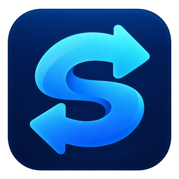
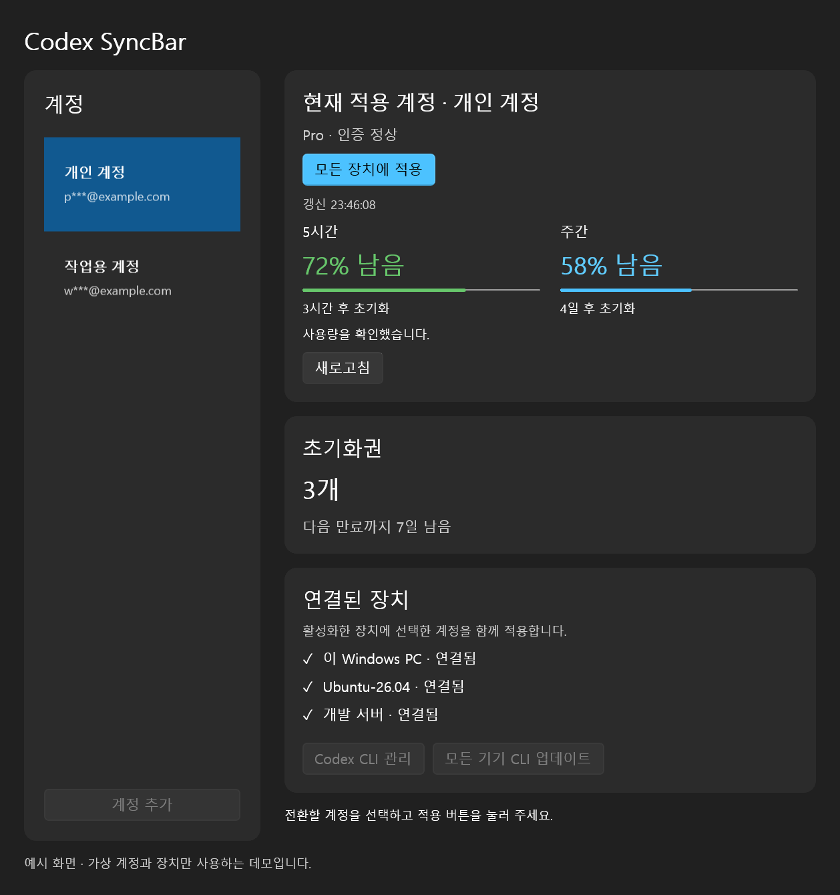
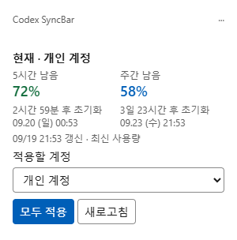
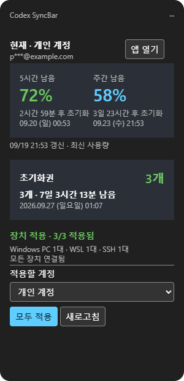

# Codex SyncBar

<p align="center">
  
</p>

**여러 Codex 계정의 사용량을 확인하고, Windows·WSL·SSH 장치의 계정을 한 번에 전환하는 Windows 11 트레이·위젯 앱입니다.**

계정별 남은 사용량과 초기화 시각을 확인하고, 연결된 기기의 Codex CLI도 병렬로 업데이트할 수 있습니다. 창을 닫아 트레이에 둔 상태에서도 사용량 갱신과 설정한 주간 자동 메시지가 동작합니다.

[Windows 설치·빌드 안내](docs/windows/README.md) · [macOS 앱 안내](docs/macos/README.md) · [검증 기록](docs/windows/QA.md)

> OpenAI의 공식 제품이 아닌 개인용 유틸리티입니다. 사용량 조회는 공개된 안정 API가 아니므로 응답 형식 변경에 따라 수정이 필요할 수 있습니다.

## Windows 화면

아래 관리 화면은 **가상 데이터로 구성한 데모**입니다. 실제 앱의 모든 조작을 재현하지 않으며, 계정·이메일·장치는 모두 예시입니다.

<p align="center">
  
</p>

### Windows 위젯

`Win + W`로 위젯 보드를 열고 **Codex 사용량 및 계정**을 추가합니다. 중간 크기에서는 사용량과 계정 전환을, 큰 크기에서는 초기화권과 장치 적용 상태까지 확인할 수 있습니다.

아래 이미지는 앱의 실제 위젯 템플릿에 가상 데이터를 넣어 렌더링한 예시입니다. Windows 위젯 보드의 여백·글꼴은 시스템 설정에 따라 달라질 수 있습니다.

<p align="center">
  
  &nbsp;&nbsp;
  
</p>

## 주요 기능

| 기능 | 할 수 있는 일 |
| --- | --- |
| 계정 관리 | 계정 추가·재로그인, 별칭 편집, 표시 순서 관리, 계정별 Chrome 로그인 세션 분리 |
| 사용량 확인 | 5시간·주간 **잔여량**, 초기화 날짜, 초기화권 수량과 만료 일정 확인 |
| 여러 장치에 적용 | 이 Windows PC와 활성화한 WSL·SSH 장치의 계정을 함께 전환하고 결과 검증 |
| SSH 연결 | 비밀번호·개인 키·기존 OpenSSH 설정 지원, 호스트 키 지문 확인, 연결 테스트와 설치·활성화 |
| CLI 관리 | 기기별 버전·설치 경로 조회, 개별 또는 **전체 병렬 업데이트**, 기기별 진행 결과와 재시도 |
| 주간 자동 메시지 | 선택한 계정의 주간 초기화 후 확인 메시지 전송, 실행 기록과 실패 재시도 |
| 트레이·위젯 | 창을 닫아도 백그라운드 갱신, 위젯에서 사용량 확인과 계정 적용 |
| 토큰 집계 | 연결된 장치의 최근 30일 토큰 사용량과 API 가격 기준 예상 비용 확인 |

계정에 5시간 한도가 제공되지 않으면 주간 한도만 표시합니다. 예상 비용은 ChatGPT 구독 청구액과 다른 참고용 추정치입니다.

## 설치

- **Windows 11 x64 또는 ARM64**가 필요합니다. 위젯은 Windows Web Experience Pack을 사용합니다.
- 계정 로그인에는 Google Chrome과 실행 가능한 Codex CLI가 필요합니다.
- WSL·SSH 기능을 사용할 대상에는 `bash`, `jq`, `node`, `tar`와 Codex CLI가 필요합니다.

현재 Windows 패키지는 소스에서 빌드하거나 [Windows CI 실행 결과](https://github.com/IlIIlIIIlIII/CodexSyncBar/actions/workflows/windows.yml)에서 받을 수 있습니다. CI 산출물은 **서명되지 않은 개발용 MSIX**이므로 바로 설치할 배포본과는 다릅니다. 직접 빌드·서명하는 절차와 인증서 신뢰 설정은 [Windows 설치 안내](docs/windows/README.md#빌드와-설치)를 참고하세요. macOS용 ZIP은 Windows 설치 파일이 아닙니다.

이미 신뢰하는 발급자가 서명한 MSIX를 받았다면 파일을 열어 설치하거나, 저장소 루트의 PowerShell에서 실행합니다.

```powershell
./Scripts/Windows/install.ps1 -PackagePath C:\Downloads\CodexSyncBar.Windows.msix
```

Codex CLI가 없다면 다음 준비 스크립트를 사용할 수 있습니다. 공식 바이너리의 체크섬을 검증하며 계정 로그인이나 현재 인증 파일은 변경하지 않습니다.

```powershell
./Scripts/Windows/setup-cli.ps1
```

## 처음 사용하기

### 1. 계정 추가와 전환

1. 앱의 **계정 추가**를 누르고 전용 Chrome 창에서 로그인합니다.
2. 왼쪽 목록에서 사용할 계정을 선택합니다. 선택만으로 실제 계정이 바뀌지는 않습니다.
3. **모든 장치에 적용**을 누르면 이 PC와 활성화된 장치에 적용하고 결과를 확인합니다.

전환 중 문제가 생기면 변경한 장치를 이전 상태로 복구합니다. 복구를 확인하지 못한 경우에는 성공으로 표시하지 않고 후속 변경을 막습니다.

### 2. SSH·WSL 장치 연결

**연결된 장치 → 장치 추가**에서 장치를 등록합니다. SSH의 기본 입력은 표시 이름·호스트·포트·사용자 이름이며, 포트 기본값은 `22`입니다.

| SSH 인증 방식 | 표시되는 입력 |
| --- | --- |
| 비밀번호 | 비밀번호 입력 |
| 개인 키 | 키 파일 선택, 선택 사항인 키 암호. 인증서 경로는 고급 옵션 |
| 기존 OpenSSH 설정 | Windows OpenSSH 설정 사용 안내 |

저장된 비밀번호나 키 암호는 다시 표시하지 않습니다. 기존 장치를 편집할 때 빈칸이면 저장된 비밀을 유지하며, 삭제는 별도 옵션을 사용합니다.

처음 접속하는 서버는 **SHA-256 호스트 키 지문**을 확인하고 신뢰 등록합니다. 기존 키가 달라진 경우에는 자동으로 덮어쓰지 않습니다. 비활성 장치도 **연결 테스트**를 할 수 있고, **설치 및 활성화**에 성공해야 전체 계정 전환 대상에 포함됩니다.

WSL은 사용할 배포판을 선택해 설치·검증합니다. 주기적인 상태 조회로 정지된 배포판을 시작하지는 않으며, 명시적인 전환·설치·업데이트는 해당 배포판을 시작할 수 있습니다.

### 3. Codex CLI 업데이트

**연결된 장치** 영역에 두 버튼이 있습니다.

- **Codex CLI 관리:** 선택한 기기의 현재 버전·설치 경로를 확인하고 업데이트합니다. 지원하는 Windows 설치가 없으면 설치를 제공합니다.
- **모든 기기 CLI 업데이트:** 등록된 Windows·SSH·WSL 기기를 **병렬**로 처리하며 기기별 진행 상태, 이전/이후 버전, 실패 이유를 표시합니다. 한 기기의 실패로 나머지 작업이 중단되지 않으며 실패한 기기만 다시 시도할 수 있습니다.

설치 후 새 버전을 검증하고 해당 기기의 관리 대상 Codex 연결을 재연결합니다. **설치 실패**와 **업데이트 완료·재연결 대기**는 구분해서 표시합니다. 일반 터미널에서 실행한 Codex 작업은 종료하지 않습니다. 설치 방식이 지원되지 않거나 호스트 키 확인이 필요하면 이유를 안내합니다.

Windows는 기존 npm 설치 또는 SyncBar 관리 바이너리를 업데이트합니다. 관리 바이너리는 공식 안정 릴리스의 해시를 검증합니다. SSH·WSL은 원격 helper가 지원하는 기존 설치 방식을 사용합니다.

## 자동 갱신과 주간 자동 메시지

**사용량은 앱이 실행 중일 때 약 5분마다 갱신됩니다.** 창을 닫아 트레이에 둬도 계속 동작하며, 위젯도 공통 제어기의 최신 사용량을 반영합니다. 수동 새로고침도 사용할 수 있습니다. 앱을 완전히 종료하거나 PC가 절전 상태이면 정해진 시각의 실행을 보장하지 않습니다.

사용량 카드의 **주간 자동 메시지 설정**에서 계정별 자동 전송을 켭니다. **기본값은 모든 계정에서 꺼짐**입니다.

- macOS 앱과 같은 방식으로 주간 한도가 초기화된 뒤 아직 사용하지 않은 계정에 짧은 확인 메시지를 한 번 보냅니다. **5시간 한도 초기화는 대상이 아닙니다.**
- 처음 켤 때도 주간 잔여량이 99.5% 이상이면 전송할 수 있습니다. 이미 사용을 시작한 계정에는 추가로 보내지 않습니다.
- 초기화 시각 변경은 두 차례 확인한 뒤 처리합니다. 실패하면 30분 이후 재시도하며 실행 기록은 재시작 후에도 유지됩니다.
- **지금 메시지 보내기**로 수동 실행하고 결과를 확인할 수 있습니다. 자동·수동 전송은 해당 계정의 Codex 사용량을 소비합니다.

전송 모델은 `gpt-5.6-luna`, 추론 수준은 `low`입니다. 메시지는 `Codex SyncBar 주간 주기 시작 확인입니다. 도구를 사용하지 말고 ‘확인’만 답해주세요.`입니다.

## 데이터 보관과 문제 해결

보관용 계정 인증과 SSH 비밀은 현재 Windows 사용자의 **DPAPI**로 암호화합니다. Codex가 직접 읽는 활성 인증 파일에는 사용자 전용 ACL을 적용합니다. SSH·WSL에는 refresh token을 제외한 인증을 전달하며 위젯에는 인증정보를 전달하지 않습니다.

| 데이터 | 위치 |
| --- | --- |
| 설정·암호화된 계정·복구 기록 | `%LOCALAPPDATA%\CodexSyncBar` — MSIX에서는 앱별 가상화 경로일 수 있음 |
| Codex 활성 인증 | `%USERPROFILE%\.codex\auth.json` 또는 설정한 `CODEX_HOME` |
| Chrome 세션·앱 관리 CLI·임시 실행 파일 | `%USERPROFILE%\.codex-syncbar` |

| 증상 | 확인할 항목 |
| --- | --- |
| 재로그인이 필요하다고 표시됨 | 해당 계정을 선택하고 **재로그인** 실행 |
| SSH 활성화 실패 | **연결 테스트**로 네트워크·호스트 키·인증부터 확인한 후 **설치 및 활성화** 재시도. 복구 안내가 있으면 먼저 복구 완료 |
| CLI 업데이트 후 재연결 대기 | 해당 기기의 Codex 연결을 다시 열고 표시된 버전 확인 |
| 위젯 추가 목록에 앱이 없음 | Windows Web Experience Pack과 로컬 개발 환경 요구 사항 확인. [위젯 안내](docs/windows/README.md#사용법) 참고 |
| 사용량이 오래된 상태로 남음 | 표시된 갱신 시각과 인증·연결 오류 확인 후 새로고침. 오류 시 마지막 정상 값을 유지 |

## 개발

.NET 10 SDK를 설치한 Windows의 저장소 루트에서 실행합니다. 스크립트는 Core 테스트 후 앱·위젯·SSH 비밀번호 도우미를 빌드합니다.

```powershell
./Scripts/Windows/build.ps1 -Architecture x64 -Package
./Scripts/Windows/build.ps1 -Architecture ARM64 -Package
```

출력은 `dist/windows`이며 위 명령의 기본 패키지는 서명되지 않습니다. 배포용 서명, WSL 개발, 안전한 데모 실행과 데이터 복구는 [Windows 개발 안내](docs/windows/README.md)에 정리했습니다. 실제 수행한 검사와 남은 검증 범위는 [QA 보고서](docs/windows/QA.md)에서 확인할 수 있습니다.

macOS 설치·화면·Swift 빌드 안내는 [macOS README](docs/macos/README.md)를 참고하세요.
