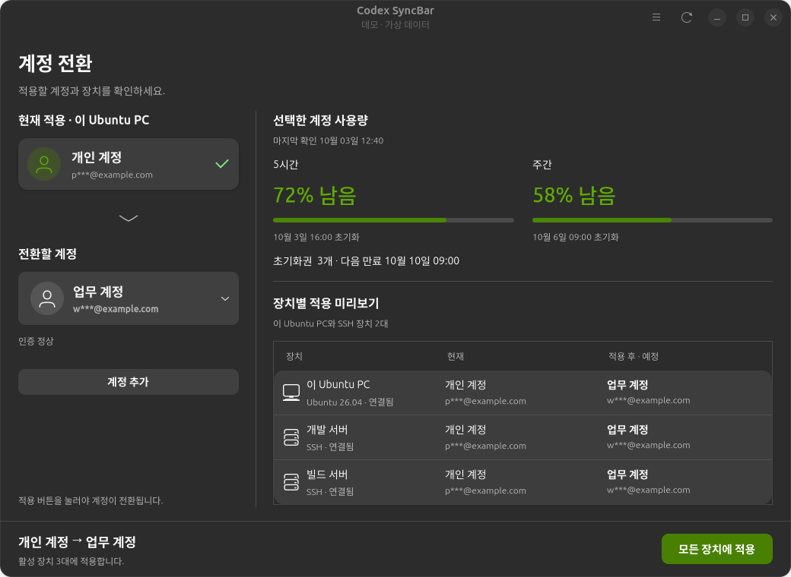

# Codex SyncBar for Ubuntu

**여러 Codex 계정의 사용량을 확인하고 이 Ubuntu PC와 SSH 장치의 계정을 한 번에 전환하는 네이티브 데스크톱 앱입니다.**

Ubuntu가 기본이자 유일한 신규 개발 대상이며 `main`에서 개발합니다. macOS·Windows와 Ubuntu 외 플랫폼 브랜치는 **deprecated**입니다.

[Ubuntu 설치·빌드 안내](docs/ubuntu/README.md) · [플랫폼 지원 정책](docs/platform-support.md)



## 주요 기능

- 계정별 사용량과 초기화 시각 확인, 계정 추가·재로그인·별칭 관리
- 현재 계정과 전환할 계정, 로컬·SSH 장치별 적용 예정 상태 확인
- 여러 장치에 계정 적용, 실패 시 복구, Codex CLI 관리
- GTK 4·libadwaita 기반 Yaru 화면, 밝은 테마·어두운 테마와 작은 창 대응
- 창을 닫아도 유지되는 사용자 서비스, 선택적인 로그인 자동 시작

## 시작하기

배포 대상은 **Ubuntu 26.04 amd64**입니다. 빌드에는 .NET 10 SDK와 Node.js가 필요하며, 실행에는 GTK 4·libadwaita·PyGObject·GNOME Secret Service와 systemd 사용자 세션이 필요합니다. 전체 의존성 및 계정 로그인 준비는 [Ubuntu 안내](docs/ubuntu/README.md)를 참고하세요.

```bash
bash Scripts/Ubuntu/test.sh
bash Scripts/Ubuntu/package.sh
```

관리자 권한 없는 사용자 설치:

```bash
bash Scripts/Ubuntu/install-user.sh
~/.local/bin/codex-syncbar
```

설치 전에 빌드와 시스템 의존성 준비를 완료하세요. 계정 선택만으로 실제 인증이 변경되지는 않으며 적용 동작을 실행해야 합니다.

## 개발 및 검증

`Ubuntu/`는 네이티브 UI·백엔드·플랫폼 코드, `Shared/`는 Ubuntu 공통 코어 프로젝트입니다. 일부 공통 소스는 아직 `Windows/CodexSyncBar.Windows.Core/`에서 참조하므로 경로 이름만으로 삭제하지 않습니다.

기본 CI는 Ubuntu 테스트와 패키지 검사를 수행합니다. 실계정 로그인·계정 전환·데스크톱 재시작 검증은 격리 테스트와 별개입니다.

## 이전 플랫폼 (deprecated)

[Windows 보관 문서](docs/windows/README.md) · [macOS 보관 문서](docs/macos/README.md)

기존 코드·브랜치·릴리즈는 이력 보존을 위해 유지합니다. 해당 플랫폼의 신규 기능 개발과 자동 CI·배포는 중단하며, 레거시 워크플로는 명시적인 수동 실행만 허용합니다.

> OpenAI의 공식 제품이 아닌 개인용 유틸리티입니다. 사용량 응답 형식 변경에 따라 수정이 필요할 수 있습니다.
